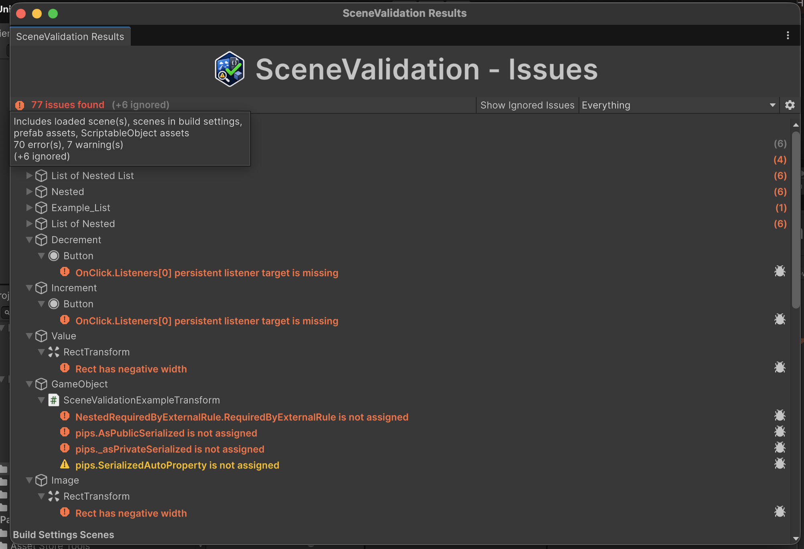
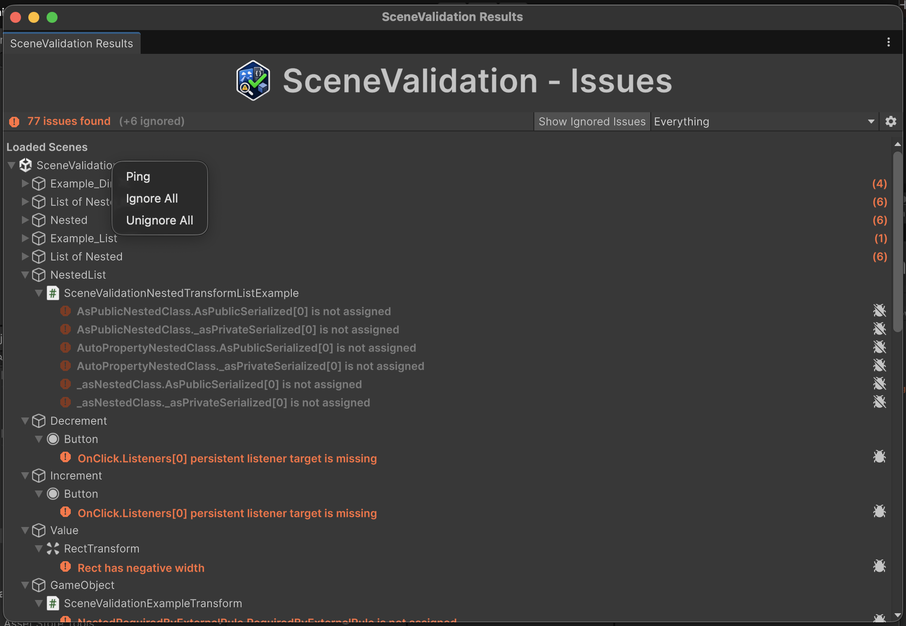

Package entry point: [README](../README.md)

---

<h1>&nbsp; Scene Validation - Results Views</h1>

`SceneValidation` exposes two results UIs that share the same grouped issue renderer, a primary Editor Window and a view embedded in the Project Settings.

## Contents

- [Validation Window](#validation-window)
- [Project Settings Issues View](#project-settings-issues-view)
- [Shared Behavior](#shared-behavior)
- [Interaction Details](#interaction-details)
- [Differences Between Views](#differences-between-views)
- [Issue Interaction Workflow](#issue-interaction-workflow)
- [Related Settings and API](#related-settings-and-api)

---

[![][1]][1]

## Validation Window

Open via:

- <kbd>Click</kbd> on the MainToolbar badge
- `Window/derHugo/SceneValidation/Issues`
- `Window/Analysis/SceneValidation/Issues`
- `Tools/derHugo/SceneValidation/Issues`

The window opens with the title **SceneValidation Issues**.

Best for day-to-day issue triage while editing.

Related configuration:

- [Project Settings - Show Toolbar Badge](ProjectSettings.md#show-toolbar-badge)
- [Project Settings - Show Hierarchy Badges](ProjectSettings.md#show-hierarchy-badges)

## Project Settings Issues View

Open via:

- `Project Settings > derHugo > SceneValidation > Issues`
- <kbd>right click</kbd> on the MainToolbar badge -> `Open Settings`

Best for global review while adjusting project-level toggles.

Related section:

- [Project Settings - Issues](ProjectSettings.md#issues)

## Shared Behavior

Both views show:

- status toolbar with counts (errors, warnings, ignored)
- grouped foldouts for validated scopes (scenes, prefabs, ScriptableObjects)
- issue rows with object or asset selection
- ignore/unignore controls per issue
- `Try Fix` when recovery is configured and `Auto Try Fix` is disabled
- row/tooltips for scene, prefab, and ScriptableObject asset paths

`Try Fix` is driven by recovery options configured through:

- [`Required`](ScriptingAPI.md#required-attribute)
- [`RequiredFieldRule<TTarget>`](ScriptingAPI.md#requiredfieldrule)

## Interaction Details

### Results toolbar

Hovering the issue count shows the validated scope and the error/warning/ignored breakdown:

- Shows total status (`errors` / `warnings`) and ignored count.
- A toggle to show/hide ignored issues appears when ignored issues exist (labeled `Ignored Issues Visible` / `Ignored Issues Hidden`).
- Scope selector (Validation Window only) changes which scopes are displayed.
- Settings button opens `Project Settings > derHugo > SceneValidation > Settings`.

### Group rows (scene, prefab, ScriptableObject, game object, component)

- <kbd>Left click</kbd> on a group row toggles fold/unfold.
- The foldout caret and the full row both toggle expansion.
- When a group is expanded, child rows are shown.
- For scene, prefab, and ScriptableObject groups, hover the row label to see the asset path tooltip.

### Group row context menu (right click)

- <kbd>Right click</kbd> on a group row opens a context menu with available actions:
- `Ping` (available on scene, game object, prefab asset, and ScriptableObject groups)
- `Ignore All` (when visible issues exist in that group)
- `Unignore All` (when ignored issues exist in that group)

`Ping` behavior:

- pings/selects the represented object when directly pingable
- if the target is embedded/sub-asset and not directly pingable in the current context, SceneValidation pings the owning parent asset instead
- scene groups ping the scene asset

### Group counters

- Collapsed groups show issue counters on the right side:
- active counter `(n)` for visible issues (error/warning styling)
- ignored counter `(n)` for ignored issues
- <kbd>Left click</kbd> on the active counter opens `Ignore All` for that group.
- <kbd>Left click</kbd> on the ignored counter opens `Unignore All` for that group.

### Issue rows

- <kbd>Left click</kbd> issue text to select/ping the issue target.
- If the issue target is unavailable, SceneValidation falls back to pinging the scene/asset path.
- Use the row icon button to toggle `Ignore` / `Unignore` for that single issue.
- `Try Fix` appears on supported issues when `Auto Try Fix` is disabled.
- `missing managed-reference types` rows provide a manual `Remove` action and are never auto-fixed.
- Special integrated rows can appear for built-in checks:
  - `missing components` on GameObjects
  - `missing managed-reference types` on GameObjects
  - `broken prefab references` on GameObjects
  - `missing ScriptableObject scripts` on ScriptableObject asset groups
  - `missing managed-reference types` on ScriptableObject asset groups

## Differences Between Views

Validation window:

- includes a scope selector to limit displayed scopes
- can show or hide ignored issues when ignored entries exist

Project Settings issues view:

- always displays the full project settings scope
- intended for combined review with `Settings`, `Rules`, and `Pre-Filters`

## Issue Interaction Workflow

1. Click an issue row to select/ping the referenced object or asset.
2. Use ignore/unignore to mute or unmute occurrences.
3. Use `Try Fix` when available to attempt configured recovery.
4. Re-run validation or continue working; results refresh incrementally.

## Related Settings and API

- [Project Settings](ProjectSettings.md)
- [UI Integrations - Results Window](UIIntegrations.md#results-window)
- [UI Integrations - Project Settings Issues View](UIIntegrations.md#project-settings-issues-view)
- [Scripting API](ScriptingAPI.md)

[1]: images/ResultsWindow_FullUI.png
