Package entry point: [README](../README.md)

---

<h1>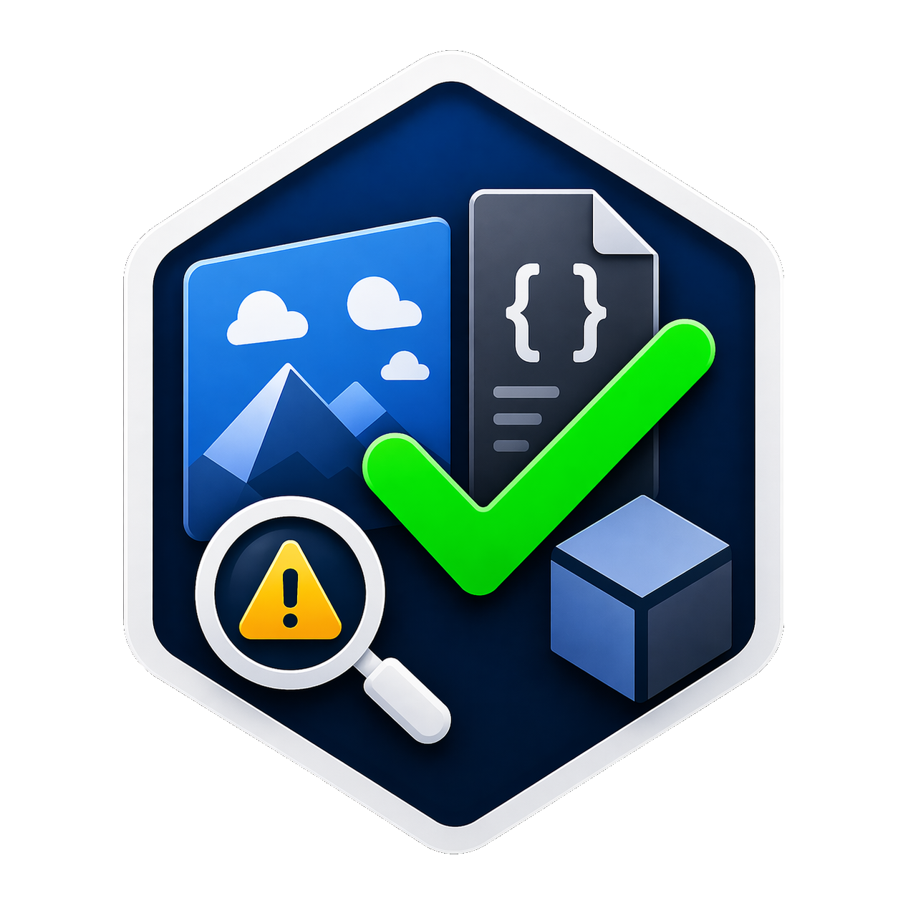&nbsp; Scene Validation - UI Integrations</h1>

`SceneValidation` can surface validation state and actions directly inside core Unity editor workflows.

[![][1]][1]

This page documents each integration, how to use it, and which states can appear.

## Contents

- [Toolbar Badge (Unity 6.3+)](#toolbar-badge-unity-63)
- [Hierarchy Badges](#hierarchy-badges)
- [Custom Object Field Drawer](#custom-object-field-drawer)
- [Prevent Entering Play Mode](#prevent-entering-play-mode)
- [Build Pre-Processor](#build-pre-processor)
- [Results Window](#results-window)
- [Project Settings Issues View](#project-settings-issues-view)
- [Related Pages](#related-pages)

---

## Toolbar Badge (Unity 6.3+)

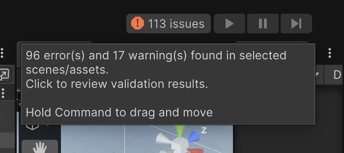</img>

Enable via [Project Settings - Show Toolbar Badge](ProjectSettings.md#show-toolbar-badge).

### Interaction

- <kbd>Left click</kbd>: opens the Validation Window.
- <kbd>Right click</kbd>: opens context actions:
  - `Refresh`
  - `Open Issues Window`
  - `Open Settings`

### States

|                                                                     |                                                 |
|---------------------------------------------------------------------|-------------------------------------------------|
|       | validation has not run yet.                     |
| 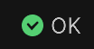        | no visible issues (ignored issues might exist). |
| 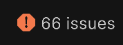    | at least one error exists.                      |
| 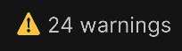 | warnings exist and no errors exist.             |
  
Note: Ignored issues are not included in the main label count but are shown in tooltip as `(+N ignored)`.

Hovering the badge shows a tooltip with the current error/warning counts and any ignored count:

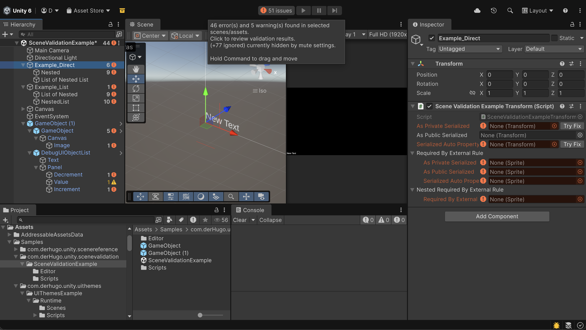

## Hierarchy Badges

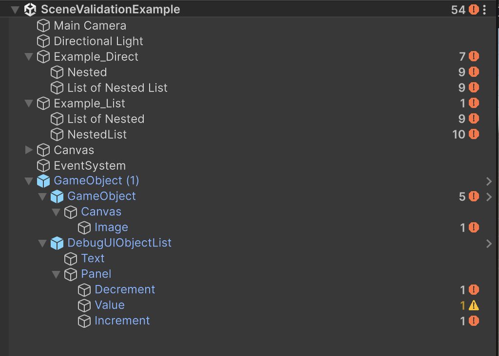

Enable via [Project Settings - Show Hierarchy Badges](ProjectSettings.md#show-hierarchy-badges).

### Scope

- Scene badges appear on loaded scene rows.
- Object badges appear on affected GameObjects in loaded scenes.
- Badge counters are active (non-ignored) issue counts.

### States

- Icon severity priority:

  |                                                                                                     |                        |
  |-----------------------------------------------------------------------------------------------------|------------------------| 
  |         | Error exists           |
  | 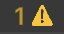    | Warning exists         |
  | 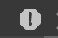     | Ignored Error Exists   |
  | 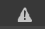 | Ignored Warning Exists |
 
- Ignored issues do not increase badge counters.
- If only ignored issues exist, the row shows icon-only (no counter).
- Folded parents can show bubbled child issues.

### Interaction

- <kbd>Left click</kbd> on a scene badge:
  - reveals issue objects in that scene hierarchy.
- <kbd>Left click</kbd> on an object badge:
  - reveals issue objects under that object (including nested/ignored issue locations).
- <kbd>Right click</kbd> opens context actions (only shown when available):
  - `ignore all (this GameObject)`
  - `unignore all (this GameObject)`
  - `ignore all recursive`
  - `unignore all recursive`

## Custom Object Field Drawer

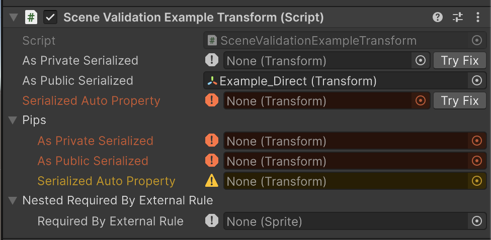

Enable via [Project Settings - Apply Custom Drawer](ProjectSettings.md#apply-custom-drawer).

Applies to unresolved object-reference members discovered through:

- [`Required`](ScriptingAPI.md#required-attribute)
- [`RequiredFieldRule<TTarget>`](ScriptingAPI.md#requiredfieldrule)

### States

|                                                                              |                 |
|------------------------------------------------------------------------------|-----------------|
| 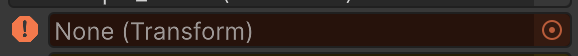           | error           
| 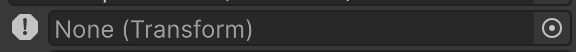   | ignored error   
| 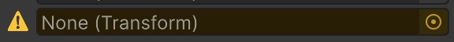         | warning         
| 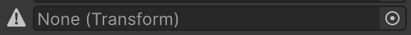 | ignored warning 
  
- Resolved references get no issue decoration

### Interaction

- <kbd>Right click</kbd> on the leading issue icon:
  - active issue: `ignore`
  - ignored issue: `unignore`
- `Try Fix` appears when:
  - recovery is configured
  - `Auto Try Fix` is disabled
  - the configured recovery is currently executable

## Prevent Entering Play Mode

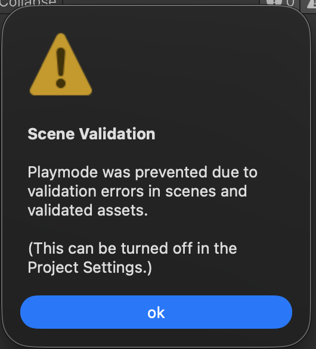

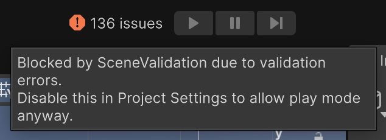

Enable via [Project Settings - Prevent Entering Play Mode](ProjectSettings.md#prevent-entering-play-mode).

When enabled, entering Play Mode is canceled while blocking validation errors exist in configured scenes
and validated assets, and the Play/Pause toolbar buttons are disabled (with an explanatory tooltip) so the
block is visible before clicking. Locating the toolbar buttons uses editor internals; if they cannot be
found on a given editor version the buttons are left untouched and Play Mode entry is still canceled.

Optional confirmation behavior:

- [Warn For Ignored Issues Before Play Mode](ProjectSettings.md#warn-for-ignored-issues-before-play-mode)

### States

- Prevent mode on + blocking errors exist:
  - entering Play Mode is canceled
  - the Play/Pause buttons are disabled with an explanatory tooltip
  - a notification dialog is shown and the validation window is opened
- Prevent mode off, or no blocking errors:
  - Play Mode entry is allowed and the Play/Pause buttons stay enabled
- Warning mode on + ignored errors exist:
  - confirmation dialog asks whether to continue entering Play Mode

Notes:

- Blocking is based on error-level issues (including ignored errors).
- Warnings do not block entering Play Mode or the Play button.

## Build Pre-Processor

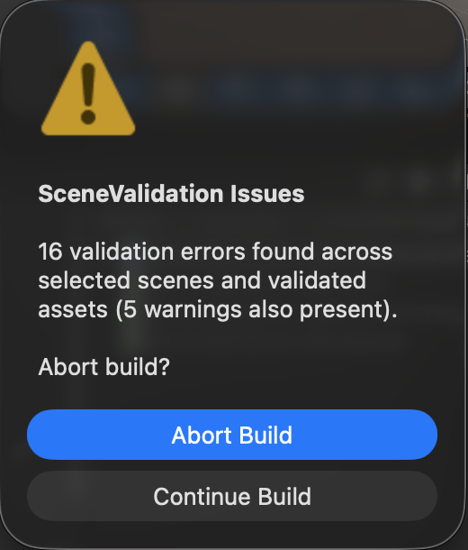
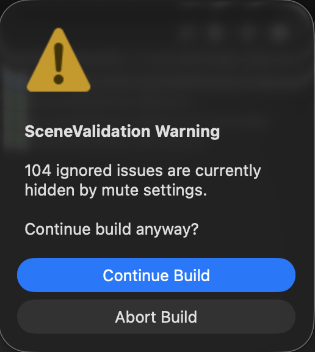

Enable via [Project Settings - Check Before Building](ProjectSettings.md#check-before-building).

Error-handling mode via [Build Issue Handling](ProjectSettings.md#build-issue-handling):

- `Fail`: abort build immediately on non-ignored blocking errors.
- `Ask`: prompt whether to continue when non-ignored blocking errors are found (interactive editor builds).

Optional confirmation behavior:

- [Warn For Ignored Issues Before Build](ProjectSettings.md#warn-for-ignored-issues-before-build)

### States

- No blocking errors (warnings only):
  - build continues.
  - warnings are logged for visibility.
- Blocking errors exist:
  - `Fail`: build stops immediately.
  - `Ask`: editor prompts whether to continue; batch mode stops because interactive confirmation is unavailable.
- Ignored blocking errors exist:
  - logged as warnings with an `Ignored:` prefix.
  - when **Warn For Ignored Issues Before Build** is enabled, a confirmation prompt is shown before continuing.
  - in batch mode, that confirmation cannot be shown, so build stops.

## Results Window

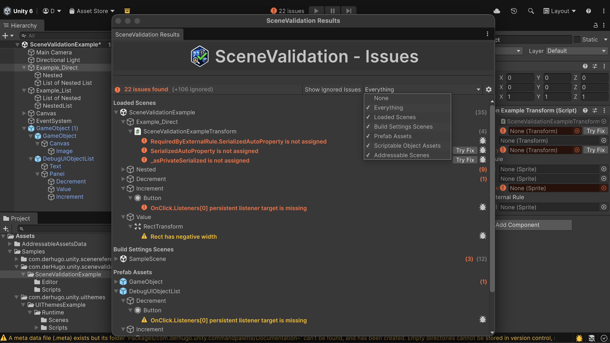

The window opens with the title **SceneValidation Issues**.

Open via:

- `Window/derHugo/SceneValidation/Issues`
- `Window/Analysis/SceneValidation/Issues`
- `Tools/derHugo/SceneValidation/Issues`
- toolbar badge click (or its `Open Issues Window` context action)

For full behavior details, see [Results Views - Validation Window](ResultsViews.md#validation-window).

## Project Settings Issues View

Open via:

- `Project Settings > derHugo > SceneValidation > Issues`

For full behavior details, see [Results Views - Project Settings Issues View](ResultsViews.md#project-settings-issues-view).

## Related Pages

- [Getting Started](GettingStarted.md)
- [Project Settings](ProjectSettings.md)
- [Results Views](ResultsViews.md)

[1]: images/Integrations.png
